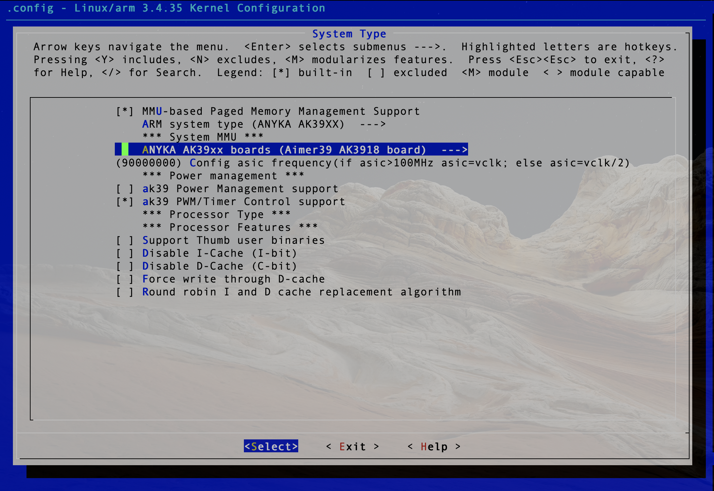

# Anyka ak3918 Linux kernel

This repository its part of a research for customising Firmware IP cameras based on V380 Anyka SoC.

Firmware source code for cheap Chinese IP cameras based on Anyka SoC aren't available for public domain.
Anyways an earlier project based on this SoC has all its needed to produce campatible kernel modules besides all video source code drivers.

Just copy some default kernel configuration from arch/arm/configs/aimer39_ak3918_XXX to your kernel .config and the kernel configuration will be readdy to add new features by kernel modules. 

```
arch/arm/configs:
aimer39_ak3916_defconfig
aimer39_ak3916_dlna_defconfig
aimer39_ak3916_ram_defconfig
aimer39_ak3918_D1_defconfig
aimer39_ak3918_defconfig
aimer39_ak3918_dlna_defconfig
ak39_micro_defconfig
ak39_producer_defconfig
ak39_sdk3910_defconfig
```


